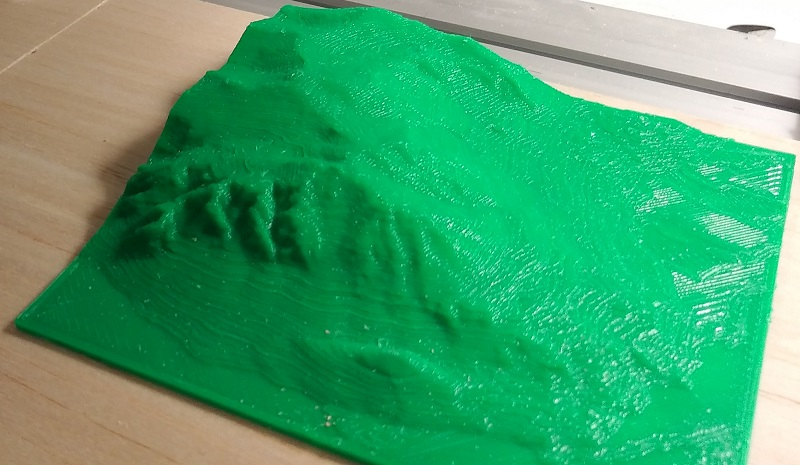

# Scripts
Maintains scripts to simplify various small actions

## Documentation

### Verify-TransientFilesAreSaved (PowerShell)
Verifies that files in a directory are backed up in another directory structure.

This is useful when burning media CDs, to ensure that files copied to the burn disk aren't inadvertently deleted from persistent storage.

### Find-DuplicateFiles (PowerShell)
Finds duplicate files from one directory in another directory structure.

Effectively, this is the inverse of the **Verify-TransientFilesAreSaved** script.

### Rename-FileExtensions (PowerShell)
Bulk renames file extensions in a directory.

This is useful to perform bulk case conversions (.PNG to .png, .MP3 to .mp3, etc) for operating-system invariant file storage.

### ConvertTo-GrayscaleImage (PowerShell)
Converts a RGB PNG image representing a 16-bit heightmap (R: LSB. G: MSB, B: Unused) to a 8-bit normalized greyscale image.

This is useful to convert my custom heightmap files into a format that other programs can use to generate STL files for 3d printing, resulting in really cool terrain maps:

### BulkConvertToMp4 (Batch)
Converts a series of files to MP4

This is useful to reduce the file size of inadequately-compressed videos and to standardize video formats such that all videos play adequately.

### PngTo30FpsMp4 (Batch)
Converts a series of numbered PNG files to a 30 FPS MP4 video

This is useful when making a video from [POV-Ray](http://povray.org/) still renders.